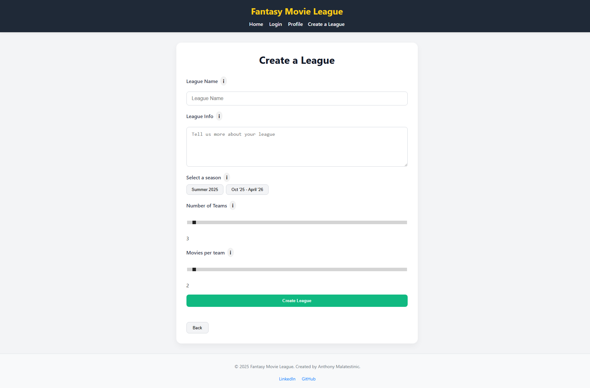
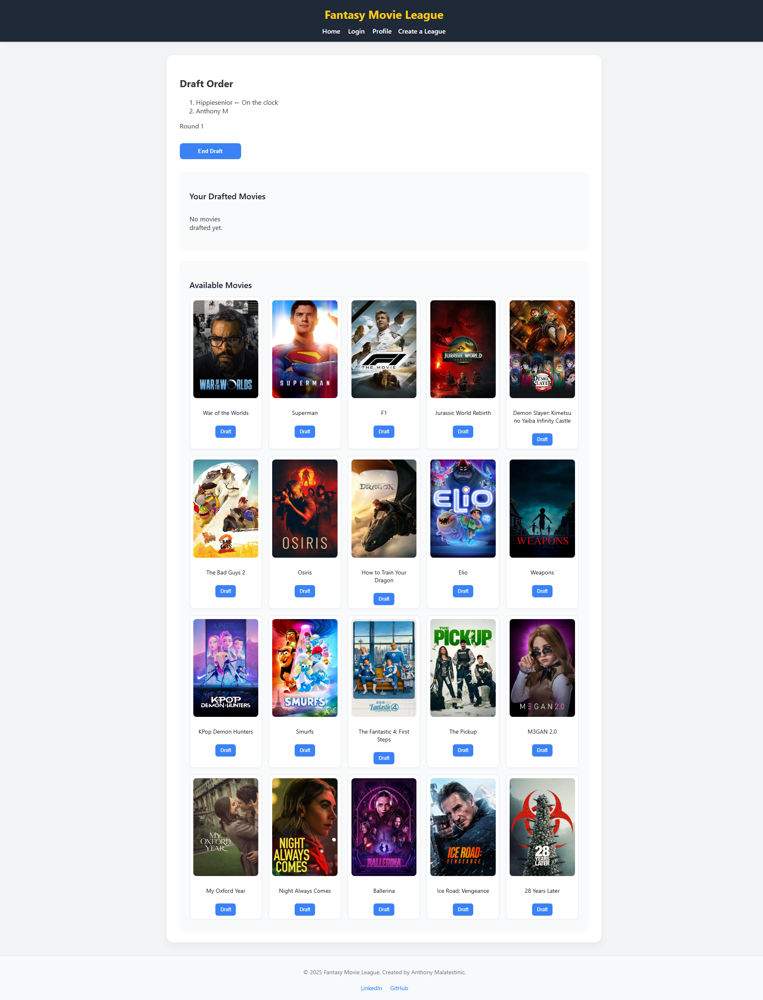
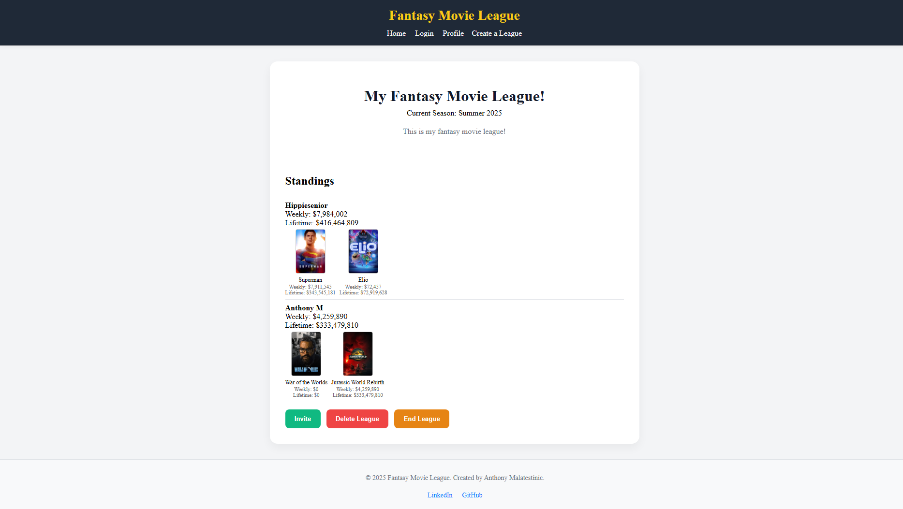

## Fantasy Movie League 🎬

## Table of contents

- [Overview](#overview)
  - [Screenshot](#screenshot)
  - [Links](#links)
- [My process](#my-process)
  - [Built with](#built-with)
  - [What I learned](#what-i-learned)
  - [Continued development](#continued-development)
  - [Useful resources](#useful-resources)
- [Author](#author)
- [Acknowledgments](#acknowledgments)

## Overview

Fantasy Movie League is a web app inspired by fantasy sports leagues — but for movies. Users can create leagues, draft movies onto their teams, and compete based on box office performance. It brings a competitive, gamified spin to movie releases.

### Screenshots

### Links

- Live Demo: [Live Demo](https://capstone-project-ashen-theta.vercel.app/)

## My Process

### Built With

- Semantic HTML5 markup
- CSS Grid & Flexbox
- Mobile-first responsive design
- React
  – Component-based UI
- Next.js
  – API routes & server-side rendering
- MongoDB
  – Database for leagues, users, and movies
- Custom draft logic (team size limits, no duplicate movies per league)

### What I Learned

- Design Next.js API routes that interact seamlessly with a MongoDB backend
- Structure a full-stack app using React for frontend and Next.js backend in one cohesive project

## Author

- LinkedIn - [Anthony Malatestinic](https://www.linkedin.com/in/anthony-malatestinic-2003b5154)
- GitHub - [@AMalatestinic](https://github.com/AMalatestinic)
